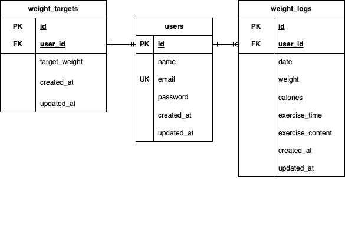

# exercise3
 PiGLy体重管理アプリ

## 概要
本プロジェクトは確認テスト３回目です。

## インストール方法
### Dockerビルド
    1. git clone git@github.com:Ami-3110/exercise3.git
    2. DockerDesktopアプリを立ち上げる。
    3. docker-compose up -d --build

        MacのM３チップのPCの場合、no matching manifest for linux/arm64/v8 in the manifest list entriesのメッセージが表示されビルドができないことがあります。 エラーが発生する場合は、docker-compose.ymlファイルの「mysql」内に「platform」の項目を追加で記載してください。

        mysql:
            image: mysql:8.0.26
            platform: linux/x86_64  # ← この行を追加
            environment:

### Laravel環境構築
    1. docker-compose exec php bash
    2. composer install
    3. 「.env.example」ファイルを 「.env」ファイルに命名を変更。または、新しく.envファイルを作成
        ```bash
        cp .env.example .env
    4. .envに以下の環境変数を修正
        DB_CONNECTION=mysql
        DB_HOST=mysql
        DB_PORT=3306
        DB_DATABASE=laravel_db
        DB_USERNAME=laravel_user
        DB_PASSWORD=laravel_pass

    5. アプリケーションキーの作成
        php artisan key:generate
    6. マイグレーションの実行
        php artisan migrate
    7. シーディングの実行
        php artisan db:seed

## 使用技術
- PHP 7.4.9  
- Laravel 8.83.29  
- MySQL 8.0.26  

## ER図


## URL
    Laravelアプリが正しく起動していると、以下のURLからアクセスできます。
    - 一覧画面（ダッシュボード）: [http://localhost/weight_logs](http://localhost/weight_logs)
    - ログイン画面: [http://localhost/login](http://localhost/login)
    - 新規登録画面: [http://localhost/register/step1](http://localhost/register/step1)

    ※ `http://localhost/` にはルート設定がないため、直接アクセスしても表示されません。

## ログイン情報
    
    テストユーザーでログインする場合は、以下の認証情報を使用してください。
    - **名前**：正内正  
    - **メールアドレス**：masa@sample.com  
    - **パスワード**：masa0000

    ※ テストユーザーは我が家のペットのセイウチにお願いしましたので、人間とは体重・運動内容が異なります。  